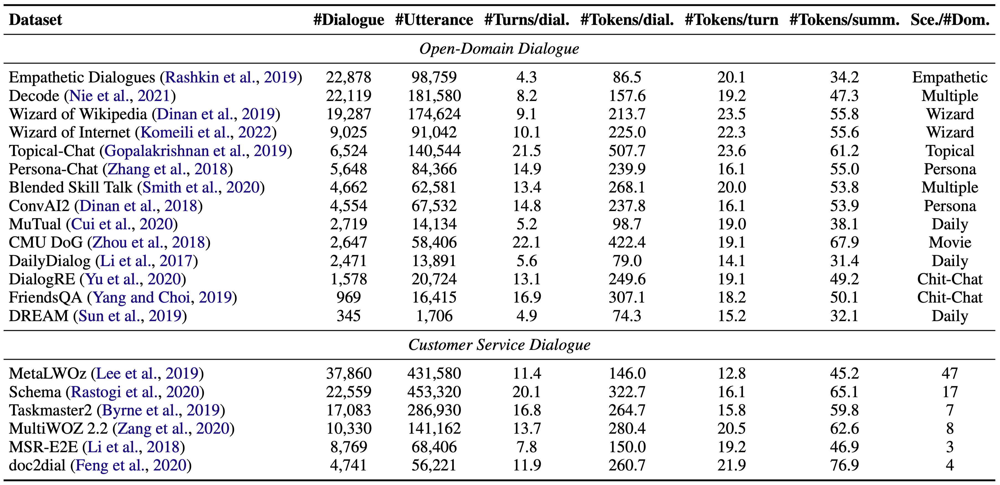

# LCM<sup>3</sup>DS Corpus
- LCM<sup>3</sup>DS is a large-scale multi-scenario multi-domain dialogue summarization corpus annotated by ChatGPT.
- LCM<sup>3</sup>DS corpus is currently available on both [**Google Drive**](https://drive.google.com/file/d/1ZtuLcSJKlWJRNdPL8rlo0a2NCbcmDwq-/view?usp=sharing) and [**Baidu Netdisk**](https://pan.baidu.com/s/10oEgcjp2htMSIqz8GWc_kQ?pwd=fy5q).
- LCM<sup>3</sup>DS corpus is a standardized high-quality corpus that you can use for pretraining on your own model architecture.



- You can use the following code to extract "*dialogue-summary*" parallel data:
```python
with open(os.path.join(dataset_path, dataset_name), 'r') as rf:
    data = json.load(rf)
dataset = []
for sample in data:
    if 'chatgpt_anno_summ' in sample:
        dialogue = [i['added_role'] + '<eor>' + i['utterance'] + '<eou>' for i in sample['dialogue']]
        summary = sample['chatgpt_anno_summ']
        dataset.append({'dialogue': dialogue, 'summary': summary})
    if 'role-rep_named-coref_summ' in sample:
        dialogue = [i['named_coref'] + '<eor>' + i['utterance'] + '<eou>' for i in sample['dialogue']]
        summary = sample['role-rep_named-coref_summ']
        dataset.append({'dialogue': dialogue, 'summary': summary})
    if 'role-rep_cust-serv_summ' in sample:
        dialogue = [i['cust_serv'] + '<eor>' + i['utterance'] + '<eou>' for i in sample['dialogue']]
        summary = sample['role-rep_cust-serv_summ']
        dataset.append({'dialogue': dialogue, 'summary': summary})
```

# MP4 Model Zoo
- Our full fine-tuned models, few-shot models, pre-trained models, and initialized model can be obtained from the following:

|Model|Google Drive|Baidu Netdisk|
|:---:|:---:|:---:|
| Fine-tuned | [**SAMSum, DIALOGSUM, TWEETSUMM**](https://drive.google.com/file/d/1hoSk-OrfGtcfc4qMfhX6yRFUFWAgLQXX/view?usp=sharing) | [**SAMSum, DIALOGSUM, TWEETSUMM**](https://pan.baidu.com/s/1aR7p4dd6Za9c4f0eB6Kdbg?pwd=tyf3) |
| Few-shot | [**SAMSum, DIALOGSUM, TWEETSUMM**](https://drive.google.com/file/d/1j7Hy58J5Cf03iBg0mYGsMGggyhK95KBW/view?usp=sharing) | [**SAMSum, DIALOGSUM, TWEETSUMM**](https://pan.baidu.com/s/10GVmjAIg-CWXtdd09s27zQ?pwd=mp2v) |
| Pre-trained | [**MP4-DAP, MP4-DAP-TOP**](https://drive.google.com/file/d/14o5V-rhoXKefTrtxZVV1ej4rQtlyRF8p/view?usp=sharing) | [**MP4-DAP, MP4-DAP-TOP**](https://pan.baidu.com/s/1rTnK1Gk78uNPy9n-oyXliA?pwd=d6sf) |
| Initialized | [**Speaker-BART**](https://drive.google.com/file/d/17sXx8fgRhRNWw1K1nr5o4AsBv4kwASnm/view?usp=sharing) | [**Speaker-BART**](https://pan.baidu.com/s/1LAv01Y71jcM8oBAAjm4K2A?pwd=u9d4) |

## Downstream Datasets
- Downstream datasets are currently available on both [**Google Drive**](https://drive.google.com/file/d/1riZX1yraagpgLIKf5YexuGXqmIa9O0DL/view?usp=sharing) and [**Baidu Netdisk**](https://pan.baidu.com/s/142DGWCutzOSwzYDk9ma-qg?pwd=n8rj).

|Dataset|Train|Val|Test|Domain|
|:---:|:---:|:---:|:---:|:---:|
| SAMSum | 14,731 | 818 | 819 | ODDS-Online |
| DIALOGSUM | 12,460 | 500 | 500 | ODDS-Daily |
| TWEETSUMM | 869 | 108 | 110 | CSDS-Tweet |

- The inference results of ChatGPT (zero-shot) on **SAMSum test set** (Appendix A of our paper) can be obtained on [**Google Drive**](https://drive.google.com/file/d/1Kr54RJHBe1czkFJjgDI3CbRQdjH8IxHa/view?usp=sharing) and [**Baidu Netdisk**](https://pan.baidu.com/s/14afZGYldAu0-X7uC8d31uA?pwd=9et9).

|Prompt|R-1|R-2|R-L|
|:---:|:---:|:---:|:---:|
| Preceding | 37.90 | 15.19 | 35.89 |
| InstructGPT | **42.17** | **16.84** | **39.26** |
| Subsequent | 40.08 | 15.41 | 37.22 |

## Inference with Our Fine-tuned SOTA Models
You can obtain all the inference results (i.e., full fine-tune, few-shot and zero-shot) of our models on [**Google Drive**](https://drive.google.com/file/d/1QhzdixA_HwRrCJ-IyKhHuKKLRv8Rg1pz/view?usp=sharing) and [**Baidu Netdisk**](https://pan.baidu.com/s/1ajEgJoyErx7bODhQBP-gsg?pwd=rdwi).

You can perform inference through the following steps:

**Step1**: Ensure that the required downstream datasets are stored in the `datasets` folder.

**Step2**: Make sure the model you wish to test is downloaded and placed in the corresponding subfolders: `models/fine-tuned`, `models/few-shot`, `models/pre-trained`, `models/initialized`.

**Step3**: Run `inference.py`. Below is an inference example:

```bash
CUDA_VISIBLE_DEVICES=0 \
python -u inference.py \
--model_path ../models/fine-tuned/MP4-DAP-TOP-SAMSum \
--dataset_name SAMSum \
--gen_use_cache \
--gen_max_length 100 \
--gen_min_length 5 \
--gen_beam_size 5 \
--gen_length_penalty 1.0 \
--gen_no_repeat_ngram_size 0 \
--infer_path ../outputs/Fine-tuned_MP4-DAP-TOP-SAMSum
```

**NOTE**: When you infer using the zero-shot setting, please ensure that the `--gen_max_length` parameter aligns with our paper.

## Fine-tuning with Our Pre-trained MP4 Models
You can fine-tune through the following steps:

**Step1**: Ensure the required fine-tuning dataset is stored in the `datasets` folder.

**Step2**: Ensure that the **MP4-DAP** or **MP4-DAP-TOP** pre-trained model is downloaded and placed in the `models/pre-trained` subfolder.

**Step3**: Run `training.py`. Below is a fine-tuning example:

```bash
CUDA_VISIBLE_DEVICES=6,7,8,9 \
python -u training.py \
--mode fine-tuning \
--model_path ../models/pre-trained/MP4-DAP-TOP \
--ckpt_save_path ../models/fine-tuned/MP4-DAP-TOP-SAMSum-Ours \
--gpus 4 \
--use_ddp \
--max_steps 1155 \
--val_check_interval 0.50 \
--num_sanity_val_steps 2 \
--accumulate_grad_batches 1 \
--progress_bar_refresh_rate 1 \
--lr 3e-05 \
--warmup_steps 100 \
--label_smoothing 0.1 \
--dataset_name Downstream_Datasets/SAMSum \
--max_length_src 1024 \
--max_length_tgt 256 \
--batch_size 16 \
--gen_use_cache \
--gen_max_length 100 \
--gen_min_length 5 \
--gen_beam_size 5 \
--gen_length_penalty 1.0 \
--gen_no_repeat_ngram_size 0
```

**NOTE**: If you wish to conduct **few-shot training**, please ensure that the `--few_shot`, `--seed`, and `--num_sample` parameters are set.

## Pre-training with Our Speaker-BART Model
- Domain-Aware Pre-training (DAP) is used for further understanding multi-scenario multi-domain dialogues, and its downstream tasks are suitable for dialogue-related tasks, not limited to dialogue summarization. The corpus with *20% masking ratio* can be found on [**Google Drive**](https://drive.google.com/file/d/1NrbLvIAh2Y0enIouXOGjsBsFvNDFpGYh/view?usp=sharing) and [**Baidu Netdisk**](https://pan.baidu.com/s/1NE1yC-ICo21YJO9k6AXJHg?pwd=mw4c), and the corpus with *40% masking ratio* can be found on [**Google Drive**](https://drive.google.com/file/d/1nxeR0nVjjqmK1u2nZByWqQDVULQpkhpZ/view?usp=sharing) and [**Baidu Netdisk**](https://pan.baidu.com/s/1rszc2pIs6ZjBHTtQFq9Qgg?pwd=9a5r).
- Task-Oriented Pre-training (TOP) is for dialogue summarization tasks, and "*dialogue-summary*" parallel data can be obtained by extracting from **LCM<sup>3</sup>DS**.

You can perform pre-training through the following steps:

**Step1**: Ensure the required pre-training datasets (i.e., **DAP_0.20**, **DAP_0.40**, or **LCM<sup>3</sup>DS.json**) are stored in the `datasets` folder.

**Step2**: Make sure the initial **Speaker-BART** model is downloaded and placed in the `models/initialized` sub-folder.

**Step3**: Run `training.py`. Below is a domain-aware pre-training example:

```bash
CUDA_VISIBLE_DEVICES=2,3,4,5,6,7,8,9 \
python -u training.py \
--mode pre-training-dap \
--model_path ../models/initialized/Speaker-BART \
--ckpt_save_path ../models/pre-trained/MP4-DAP-Ours \
--gpus 8 \
--use_ddp \
--max_steps 5000 \
--val_check_interval 0.50 \
--num_sanity_val_steps 100 \
--accumulate_grad_batches 1 \
--progress_bar_refresh_rate 1 \
--lr 3e-05 \
--warmup_steps 500 \
--label_smoothing 0.1 \
--dataset_name DAP_0.20 \
--val_dataset_name SAMSum-DIALOGSUM-TWEETSUMM \
--max_length_src 1024 \
--max_length_tgt 1024 \
--batch_size 16 \
--gen_use_cache \
--gen_max_length 100 \
--gen_min_length 5 \
--gen_beam_size 5 \
--gen_length_penalty 1.0 \
--gen_no_repeat_ngram_size 0
```

**NOTE**: When conducting task-oriented pre-training, please ensure that the `--max_length_tgt` parameter is set to 256 or 512.

## The Function of Utils
- `ckpt2bin.py` can convert the `.ckpt` model you've saved after training into the commonly used `.bin` model in transformers. Also, in `inference.py` and `training.py`, there's a `--resume_ckpt` parameter that can directly load the `.ckpt` model.
- `evaluation.py` directly calculates the rouge scores between the model's prediction outputs and the ground truths.

## Support
If you have any questions, please contact [wxzhou@buaa.edu.cn](mailto:wxzhou@buaa.edu.cn) or provide feedback in the issues section.

## Citation
If you find this work useful and have used the code or data, please cite the following paper:
```
@article{zhou2023multi,
  title={Multi-Stage Pre-training Enhanced by ChatGPT for Multi-Scenario Multi-Domain Dialogue Summarization},
  author={Zhou, Weixiao and Li, Gengyao and Cheng, Xianfu and Liang, Xinnian and Zhu, Junnan and Zhai, Feifei and Li, Zhoujun},
  journal={arXiv preprint arXiv:2310.10285},
  url={https://arxiv.org/pdf/2310.10285.pdf}
  year={2023}
}
```
